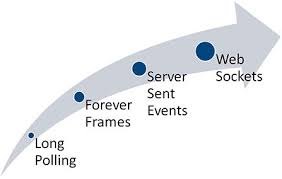
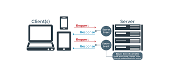
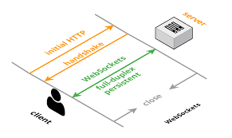
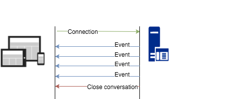

# Pourquoi choisir Server-sent Events ?

Bien que l’usage de données en temps réel est compliqué à implémenter. L’affichage de donnée en temps réel dans votre application web est possible dans plusieurs technologies.


Exemples d’applications web de transfert de données en temps réel : 
-	Application boursière (transfert de petites quantités de chaînes JSON).
-	Possibilité d’acheter ou de vendre des biens en temps réel (à travers un widget).
-	Jeux-multi-joueurs de quelques heures.
-	Chat ou discussions en ligne.


## Polling / Long Polling : 

Interrogation longue, « Long Polling ». Le client pull une demande de données **constamment** au serveur. Le serveur envoi une réponse positive, il envoie ses données et une réponse négative, il envoie une réponse qu’il n’y a pas de donnée. Puis il ferme la demande. Il se produit une **dégradation des performances**.
### Ajax :
Ajax qui fonctionne sur le protocole HTTP, avec un en-tête et un message complet, et l’approche des widgets rencontre des difficultés. Provoquant une latence maximale et une connexion HTTP persistance, les réponses du serveur seront désynchronisées.
### Serveur NGINX :
Permet un équilibrage de charge. Le proxy permet de masquer les points de terminaison derrière le même domaine. L’utilisation du multiplexage HTTP/2 permet de produire des réponses qui ont lieu simultanément dans une **connexion persistance**.

## Websockets : 

Permet d’ouvrir une session de communication interactive entre le navigateur de l’utilisateur et le serveur. C’est une API qui envoi des messages au serveur et qui reçoit des réponses aux événements sans à avoir à interroger le serveur. Fonctionne sur des canaux de communication en **duplex intégral via une connexion TCP** (couche 4 : application du modèle OSI). La technologie a une dépendance à l’infrastructure informatique, elle doit se confronter aux limites de connexion pour les requêtes http (autour de 6) d’environ **50 connexions par onglets**. Elle ne s’exécute pas sur http et l’implémentation d’une connexion persistante (multiplexage http/2) entre le serveur et le client n’est pas profitable à cette technologie.
### Serveur proxy :
Le bon fonctionnement est dépendant du trafic réseaux du fournisseur de service Internet, de la configuration du proxy pour le trafic réseaux et d’exécution **des proxies TCP qui diffèrent** des utilisations des proxies HTTP plus courants.
### Duplex integrale :
La technologie est profitable lors de communications en duplex tels que les discussions en ligne et les jeux-multi-joueurs de **quelques heures seulement**. Mais le maintien d’une connexion ouverte réduit la **durée de vie de la batterie** des appareils mobiles. Les connexions sont combinées aux **authentifications**, à l’utilisation de l’antenne à chaque **accès à Internet** et la **redirection vers le proxy** interne du fournisseur de service mobile.

## Server-Sent Events : 

événements envoyés en temps réel émis par le serveur et reçus par le navigateur (page web) avec une méthode de communication à sens unique à partir du serveur via HTTP. La connexion peut être interrompue, aussi l’interface EventSource sur le client, similaires aux événements JavaScript, retente automatiquement de se reconnecter. Le délai d’attente avant que le client tente une reconnexion peut être contrôler par le serveur. Les messages manqués lors de la reconnexion du client sont restitué par le serveur.
### Flux de données : 
Flux de connexion qui provient du serveur et en **lecture seule** avec des requêtes HTTP pour une connexion persistante y compris la mise en place du multiplexage. Le temps de reconnexion est de quelques ms avec **trois états de connexion** possibles : connexion-ouvert-fermé et trois événement intégrés : Ouvrir-Message-Erreur.
### Baisses de connexion : 
Connexion **automatique** rétablie par le navigateur où le serveur peut fermer une connexion de manière permanente, alors le navigateur peut abandonner sa reconnexion après l’expiration d’un délai.

### Exemples de code :
#### Côté client : 
Abonnement à une flux d'événements avec **EventSource** :
```javascript
if (!!window.EventSource) {
  var source = new EventSource('stream.php');
} else {
  // Result to xhr polling :(
}
```
Connexion à la source et attente de réception des messages :
```javascript
// subscribe for messages
    var source = new EventSource('URL');
    // handle messages
    source.onmessage = function(event) {
        // Do something with the data:
        event.data;
    };
```

#### Coté serveur :
Gestionnaire de serveur pour SSE:
```javascript
function handler(response)
    {
        // setup headers for the response in order to get the persistent HTTP connection
        response.writeHead(200, {
            'Content-Type': 'text/event-stream',
            'Cache-Control': 'no-cache',
            'Connection': 'keep-alive'
        });

        // compose the message
        response.write('id: UniqueID\n');
        response.write("data: " + data + '\n\n'); // whenever you send two new line characters the message is sent automatically
    }
```
Configuration du gestionnaire pour l'événement "message" et écoute des événements "open" et "error" :
```javascript
source.addEventListener('message', function(e) {
  console.log(e.data);
}, false);

source.addEventListener('open', function(e) {
  // Connection was opened.
}, false);

source.addEventListener('error', function(e) {
  if (e.readyState == EventSource.CLOSED) {
    // Connection was closed.
  }
}, false);
```

#### Format de flux d'événeement :
```javascript
data: {\n
data: "msg": "hello world",\n
data: "id": 12345\n
data: }\n\n
```

### Exemple d'aplication
[demo1 SSE](http://www.abrandao.com/lab/Javascript/Javascript_SSEvents/browser_cpu.html)  
[demo2 SSE](https://github.com/simonprickett/server-sent-events-demo)  
[demo1 WebSockets](http://demos.kaazing.com/portfolio-web/index.html)  
[demo2 WebSockets](https://www.websocket.org/demos/racer/run/)  

## Conclusion :
SSE est viable pour effectuer de l'affichage de données en temps réeel dans votre navigateur pour la lecture seul. Le multiplexage des demandes provenant du même domaine (avec HTTP/2) permet d'obtenir **une seule connexion pour plusieurs réponses**.  

Les principaux avantages sont l'implémentation simple, un multiplexage HTTP/2 automatique et permet d'**économiser la batterie** d'une appareil mobile en déchargeant la connexion proxy. 

L’efficacité est donc dans l’**utilisation efficace du réseau** et de la batterie des appareils mobiles. Avec la technologie SSE, seuls les événements envoyés par le serveur sont prit en compte dans le concept de la diffusion en continu.
